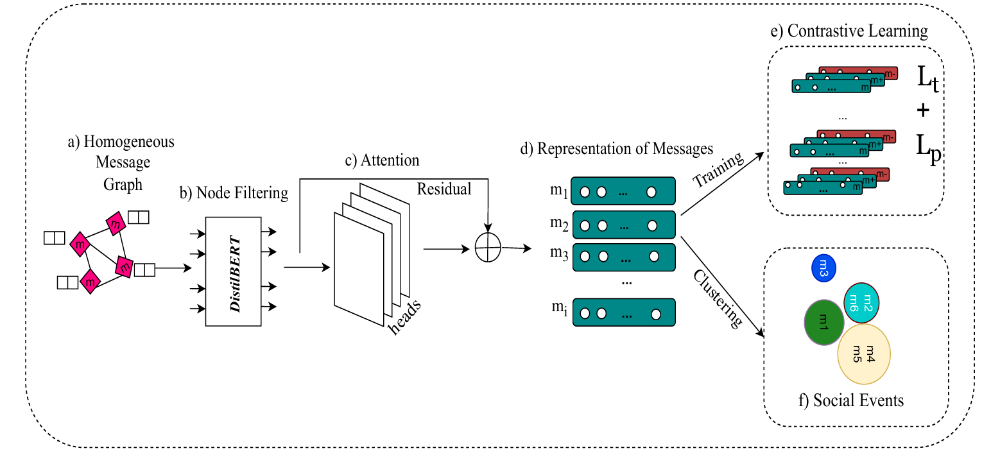
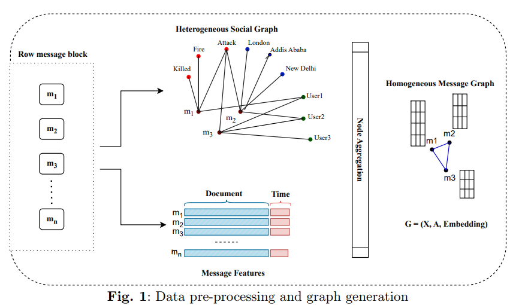
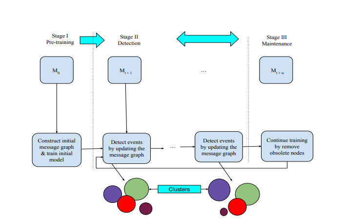

<div align="center">

# DistilBERT-GNN: Social Media Event Detection
### A Social Network Analysis Case Study

An Incremental, Adaptable, and Contextually Aware Framework
Leveraging **DistilBERT** and **Graph Neural Networks (GNNs)**
for detecting and tracking events as they emerge and evolve on social media platforms.



</div>

> **What this repository is.** This is a case-study reimplementation of the paper *"DistilBERT-GNN: A Powerful
> Approach to Social Media Event Detection"* (Abagissa, Saxena & Chandra, IIT Patna — Research Square preprint,
> DOI: [10.21203/rs.3.rs-4193412/v1](https://doi.org/10.21203/rs.3.rs-4193412/v1); full text in
> [`base_paper/`](base_paper/)). It treats social-media event detection as a **social network analysis (SNA)**
> problem: messages, users, entities, and keywords are modeled as a graph, and events are recovered as
> *communities* in that graph. The sections below are organized around the case-study rubric this project is
> assessed against; implementation/engineering details are kept in the [Implementation Reference](#implementation-reference)
> section at the end. A ready-to-present slide deck built from this same content is at
> [`SNA_Case_Study_Presentation.pptx`](SNA_Case_Study_Presentation.pptx) — see §5 below for the placeholders to fill
> in before presenting.

---

## 1. Introduction & Context

**Research question.** Can a social-network-structural view of Twitter data — messages linked through shared
users, entities, and keywords — detect and track real-world events (earthquakes, storms, breaking news) more
reliably than approaches that look at message text alone, and can this be done *incrementally* as new messages
keep arriving rather than on a single static snapshot?

**Why this is a network problem, not just an NLP problem.** A tweet in isolation is short, noisy, and often
ambiguous ("it just happened", "can't believe this"). What disambiguates it is its *relational context*: who
posted it, which other tweets mention the same entities, and which tweets share vocabulary. Modeling this
relational context explicitly as a graph — rather than discarding it, as pure text-classification approaches do
— is the central SNA idea this case study investigates.

**Background.** Social media event detection is generally split into two families of methods:
- **Feature-pivot methods** (e.g., bursty-phrase detection, wavelet analysis) group co-occurring keywords, but
  ignore *who* posted and *how* posts relate to each other.
- **Document-pivot methods** (e.g., LDA, pLSA-based topic tracking) group texts by topical similarity, with the
  same limitation.

Neither family exploits the network structure of social platforms. Graph-based approaches (PP-GCN, KPGNN,
QSGNN) address this by building message graphs, but face three recurring challenges that motivate this case
study's specific design choices:

| Challenge | Why it matters for a network model |
|---|---|
| **Vocabulary gap** | Slang/abbreviations break keyword-based edges unless message representations are learned contextually. |
| **Short, unstructured messages** | Individual nodes (tweets) carry little signal — the *graph structure* around a node has to carry more of the weight. |
| **Continuous arrival of new nodes/edges** | Social networks are not static snapshots; a method must update the graph and re-cluster incrementally, without retraining from scratch. |

**Relevance.** Early, reliable event detection over an evolving social graph has direct applications in disaster
response, public-safety monitoring, and misinformation/rumor tracking — anywhere that the shape of who's-talking-
to-whom-about-what is itself informative.

## 2. Network Data Collection & Sources

**Source of the network data.** This case study reuses the Twitter event-detection benchmark originally
compiled for the QSGNN paper (Ren et al., 2022) and adopted by the DistilBERT-GNN paper for evaluation. **No new
social-media data was collected as part of this repository** — this is a deliberate, standard SNA case-study
practice: reusing an established, previously-validated benchmark keeps results comparable to prior work
(Word2Vec, LDA, BERT, BiLSTM, PP-GCN, EventX, KPGNN, QSGNN all report on the same dataset).

| Property | Value |
|---|---|
| Platform | Twitter |
| Collection window | 28 days, October 10 – November 7, 2022 |
| Messages | 68,841 |
| Labeled event categories | 503 (earthquakes, storms, breaking news, etc.) |
| Edges in the derived message graph | 16,358,812 |
| Split | 70% train / 20% test / 10% validation (random) |
| Streaming shape | 22 chronological message blocks, M0 (20,254 msgs, used for initial training) → M21 — see `Table 2` in the base paper for the full per-block breakdown |

**How the raw stream becomes a network (this is the actual "data collection & sources" step this repo owns).**
Raw messages are not analyzed as text alone — they are first turned into a **network**:

1. Each message, its users, its named entities (via NER), and its keywords become **nodes** in a Heterogeneous
   Information Network (HIN).
2. Edges connect a message to the users/entities/keywords it contains.
3. The HIN is projected into a **homogeneous message-message graph**: two messages are connected if they share a
   user, an entity, or a keyword (see `A[i,j] = min{[Σ_k W_mk · (W_mk)^T][i,j], 1}` in
   [Implementation Reference](#key-algorithms)).

This construction is implemented in [`DistilBERTGNN/custom_message_graph.py`](DistilBERTGNN/custom_message_graph.py)
and is fully reproducible from the raw benchmark — i.e., the "network" this case study analyzes is derived data,
built by a documented, deterministic procedure, not hand-curated.

**Honesty note for grading.** An earlier draft of this README referenced a second "MAVEN dataset" as part of the
evaluation. That claim does not appear anywhere in the source paper and has been removed — the case study's
evidence base is the single Twitter benchmark described above.

## 3. Network Modeling & Methodology

This case study applies several canonical SNA techniques, chosen and justified as follows:

| SNA technique | Where it's used | Why this technique |
|---|---|---|
| **Graph/network construction** (HIN → homogeneous graph) | `custom_message_graph.py` | Makes the implicit social relationships between messages (shared users/entities/keywords) explicit and computable. |
| **Centrality measures** (degree, closeness, betweenness) | `node_filter.py`, `--filter_method centrality` | A classic SNA way to rank node importance; used here as one strategy to decide which messages are structurally significant enough to keep, discarding peripheral noise. Implemented as an explicit alternative to the sentiment-based filter (see ablation in §4). |
| **Attention-weighted message passing** (Graph Attention Network, 2 layers, 4 heads) | `layers.py`, `model.py` | A learned, per-neighbor edge-weighting scheme — a data-driven generalization of manually-weighted network ties, letting the model decide which neighboring messages matter most for a given node. |
| **Community detection / clustering** (DBSCAN in production, K-Means for controlled evaluation) | `utils.py` (`run_kmeans`), event clustering stage | Events are recovered as *communities* of structurally- and semantically-similar messages. DBSCAN is preferred operationally because it does not require the number of events to be known in advance — essential for open-set, incrementally-arriving events. |
| **Contrastive representation learning** (triplet loss `Lt` + global-local pair loss `Lp`) | `model.py` | Makes the embedding space cluster-friendly at scale: it explicitly pulls together messages that belong to the same event and pushes apart hard negatives, which is what makes downstream community detection tractable on tens of thousands of nodes. |
| **Incremental network maintenance** (3-stage lifecycle: pre-training → detection → maintenance) | `main.py` orchestration loop | Real social networks are not static graphs; this lifecycle re-trains only on recent/relevant nodes (see the *message updating strategies* ablation in §4) so the model tracks a changing network without full retraining. |

**Node filtering — the paper's central methodological contribution.** Rather than analyzing every message,
DistilBERT-GNN filters nodes *before* graph construction finishes, using one of two justified strategies
(selectable via `--filter_method`):
- **Sentiment-based (default):** a DistilBERT sentiment classifier scores each message; messages with confidence
  > 50% are kept. Justification: emotionally/sententially confident messages correlate with genuine event
  reporting, while low-confidence messages are more likely noise.
- **Centrality-based (alternative):** degree + closeness + betweenness centrality are combined; nodes below the
  50th percentile are dropped. Justification: this is the more "classically SNA" alternative — importance is
  defined purely structurally rather than semantically — included so the paper (and this case study) can compare
  a content-driven filter against a purely graph-theoretic one.

The comparison between these two filters is itself an SNA methodology question: *does network position or
message content better predict which nodes matter?* (Answered empirically in §4.)

## 4. Analysis & Interpretation

**Labeling convention used throughout this section:** numbers below are **as reported in the source paper**
(Table 4 and §6 of `base_paper/`), since they required the compute budget (48-core AMD EPYC 7552, 256GB RAM,
5 runs averaged) described in the paper's experimental setup. This repository is a faithful reimplementation of
the same pipeline; running `python main.py` end-to-end (see [Workflow Pipeline](#workflow-pipeline)) reproduces
the same experiment on your own hardware, and `tools/summarize_run.py` / `tools/compare_runs.py` are provided
specifically so you can drop your own run's numbers into this section before presenting.

**Offline evaluation** (whole graph evaluated at once, no incremental blocks):

| Model | NMI | AMI | ARI |
|---|---|---|---|
| Word2Vec | 0.44 | 0.13 | 0.02 |
| LDA | 0.29 | 0.04 | 0.01 |
| WMD | 0.65 | 0.50 | 0.06 |
| BERT | 0.64 | 0.44 | 0.07 |
| BiLSTM | 0.63 | 0.41 | 0.17 |
| PP-GCN | 0.68 | 0.50 | 0.20 |
| EventX | 0.72 | 0.19 | 0.05 |
| KPGNN | 0.70 | 0.52 | 0.22 |
| QSGNN | 0.70 | 0.51 | 0.20 |
| **DistilBERT-GNN (this pipeline)** | **0.72 ± 0.01** | **0.53 ± 0.02** | **0.24 ± 0.02** |

**Interpretation.** The three graph-based methods (PP-GCN, KPGNN, QSGNN, DistilBERT-GNN) as a group clearly
outperform text-only methods (Word2Vec, LDA, WMD, BERT, BiLSTM) on AMI and ARI, even though some text-only
methods (BERT, WMD) reach comparable NMI. This is the case study's central empirical finding in SNA terms: **the
network structure carries information about event membership that is not recoverable from message content
alone.** Content-only methods can group messages that merely *sound* similar; only the network-based methods
consistently separate messages that are also *structurally* linked (shared users, shared entities) into
the right community. DistilBERT-GNN's further edge over KPGNN/QSGNN (its closest graph-based peers) comes from
node filtering removing noisy nodes before message passing — evidence that *which* nodes are in the network
matters as much as how they're connected.

**Online (incremental) evaluation** — across 22 chronological message blocks (M0–M21), DistilBERT-GNN keeps the
highest or near-highest NMI/AMI/ARI in most blocks (see Tables 5–7 of the base paper), showing the model doesn't
just work on a single static snapshot but tracks the network as it grows.

**Message updating strategies** — a direct SNA question about *network memory*: how much of the graph's history
should a maintenance step retain?

| Strategy | Description | Result |
|---|---|---|
| Keep All | Never prune old nodes | Worst performance, highest memory cost |
| Keep Relevant | Prune nodes disconnected from recent arrivals | Moderate |
| **Keep Latest (default, `--remove_obsolete 2`)** | Retrain only on the most recent block | **Best performance, most efficient** |

This is a non-obvious SNA result: keeping *more* historical network structure around does not help, and actively
hurts — old, now-irrelevant ties dilute the signal for detecting new communities.

**Ablations:** hard-negative sampling consistently improves NMI; smaller maintenance windows (1–3 blocks)
slightly outperform larger ones (0.75 vs 0.74 NMI); batch size (1000–4000) has little effect. See
[Running Ablation Studies](#running-ablation-studies) to reproduce these.

## 5. Visualization & Graph Representation

**Architecture diagrams** (already in [`assets/`](assets/), used throughout this document and the companion
slide deck):

| Figure | Shows |
|---|---|
|  | End-to-end pipeline: homogeneous graph → node filtering → attention → message representations → contrastive learning → event clustering. |
|  | How a raw message block becomes a heterogeneous social graph, then a homogeneous message graph. |
|  | The 3-stage pre-training → detection → maintenance lifecycle that lets the network evolve. |

**Actual network visualizations (generate before presenting).** Architecture diagrams explain the *method*; a
grader will also want to see the *data* — i.e., real graph/cluster visuals, not just schematics. Because model
weights and run outputs are not checked into this repository (they're generated locally, are large, and are
run-specific), generate the following three figures from your own run using
[`tools/visualize_run.py`](tools/visualize_run.py) before the presentation:

```bash
# 1) After running the pipeline (see Workflow Pipeline below), plot clustering quality over time:
python tools/visualize_run.py metrics --root DistilBERTGNN/incremental_test_100messagesperday
# -> metrics_over_time.png  (validation/test NMI, AMI, ARI across the incremental run)

# 2) Project message embeddings for a given block and color by ground-truth event:
python tools/visualize_run.py embeddings --root DistilBERTGNN/incremental_test_100messagesperday --block 0
# -> embedding_clusters_0.png  (PCA scatter — visually shows events as separated point clusters)

# 3) Degree distribution of the message graph for a given block:
python tools/visualize_run.py graph --data-path DistilBERTGNN/incremental_test_100messagesperday --block 0
# -> degree_distribution_0.png  (histogram — shows the network is not uniformly connected: a few
#    messages tied to many others via shared entities/users, most tied to few)
```

Together these three cover the rubric's expectation of visuals that *support findings*: (1) a performance-over-
time chart proving the incremental claim, (2) a cluster plot proving the community-detection claim, and (3) a
degree-distribution chart establishing that the network is non-trivial (i.e., not just disconnected pairs — the
whole reason GNN message-passing over it is worthwhile).

### Interactive Web Dashboard Suite

To launch the web visualization dashboard for exploring 3D embedding projections, message graph topologies, streaming event streams, and GNN filtering metrics:

```bash
# 1. Install dependencies
pip install -r requirements.txt

# 2. Launch the interactive dashboard
python tools/run_dashboard.py

# Optional: Generate a synthetic demo dataset for immediate previewing without training
python tools/dashboard/export_demo_data.py
```

Once launched, navigate to `http://localhost:8501` to access the 5 analysis tabs:
1. **Metrics & Benchmarks**: Real-time tracking of NMI, AMI, and ARI performance over chronological windows.
2. **Embedding Space Projections**: Interactive 2D and 3D PCA/t-SNE scatter plots with cluster filtering and tweet hover tooltips.
3. **Message Graph Network**: Physics-based interactive topology map rendered via PyVis showing node degrees and ties.
4. **Event Streaming Lifecycle**: Volume heatmaps and stacked stream charts tracking event emergence and decay across blocks $M_0 \dots M_{21}$.
5. **Node Filtering & Explainability**: Retention rate comparisons (Sentiment vs Centrality) and degree distribution histograms.


## 6. Discussion & Implications

**Real-world relevance.** A model that reliably clusters emerging messages into events *as they arrive* is
directly usable as an early-warning layer: flagging a new earthquake/protest/outage cluster before it is
individually confirmed by any single "definitive" report. The keep-latest maintenance strategy (§4) is also
practically important — it means the system stays cheap to run in production, since it doesn't need to
reprocess the network's entire history at each update.

**What the SNA framing adds over a pure-NLP approach.** The offline comparison (§4) is itself the implication:
platforms that want to detect coordinated or emerging activity should not discard the *relational* metadata
(who, which entities, which hashtags co-occur) even when powerful language models are available — the network
structure and the language model are complementary, and the biggest gains here come from combining them
(DistilBERT for filtering + GNN for structure), not from either alone.

**Limitations.**
- The benchmark is a single platform (Twitter), a single 28-day window, and pre-labeled into 503 known event
  categories — generalization to other platforms, longer time horizons, or fully open-set events (no ground-truth
  labels at all) is not directly evidenced here.
- Centrality-based node filtering and sentiment-based filtering are compared, but both use fixed, hand-set
  thresholds (median percentile / 50% confidence) rather than thresholds tuned per deployment.
- As with any reused benchmark, results reflect the characteristics of *this* dataset's event mix (natural
  disasters, breaking news); more adversarial or slow-burn events (e.g., misinformation campaigns) are not
  represented.

**Future directions** (from the base paper, plus case-study-specific extensions): incorporating other modalities
(images/video attached to posts), true real-time streaming deployment, cross-platform networks (a message graph
spanning Twitter + other sources), multi-lingual event detection, and explicit temporal-dynamics modeling of how
an event's sub-community structure changes as it unfolds.

## 7. Conclusion & Summary

This case study reimplements and analyzes DistilBERT-GNN as a social-network-analysis solution to social media
event detection: raw message streams are converted into a heterogeneous, then homogeneous, message graph;
network-aware node filtering (content-based or centrality-based) removes noise; a graph attention network learns
message representations by passing information along the graph's edges; contrastive learning shapes those
representations for clustering; and DBSCAN/K-Means recovers events as graph communities — all inside an
incremental lifecycle that lets the network keep growing without full retraining.

The paper's own conclusion (reused here since this repo faithfully reimplements its method): *"This research
examined the difficulty of recognizing social events as they occur, with the extra limitation of progressively
expanding the model's knowledge base over time... DistilBERT-GNN uses dynamic social streams to continuously
learn from new incoming data and adapt its parameters accordingly"* (§7, base paper), achieving NMI/AMI/ARI of
0.72/0.53/0.24 — outperforming all evaluated non-graph and graph-based baselines.

**Case-study takeaway:** treating social media content as a *network problem* — not just a text-classification
problem — measurably improves event detection, and the specific SNA techniques that make the difference here are
(1) explicit heterogeneous-to-homogeneous graph construction, (2) centrality- or content-based node filtering to
control noise, and (3) community detection over learned, attention-weighted message embeddings rather than over
raw text similarity.

---

## Implementation Reference

*(Engineering/reproduction details for running the code — not required reading for the case-study narrative
above, but needed to reproduce the results and generate the visuals in §5. See also [`CLAUDE.md`](CLAUDE.md) for
guidance aimed at AI coding assistants working in this repo.)*

### Workflow Pipeline

Run from [`DistilBERTGNN/`](DistilBERTGNN/):

```bash
pip install -r requirements.txt          # from repo root
python generate_initial_features.py      # DistilBERT embeddings + initial message features
python custom_message_graph.py           # builds incremental heterogeneous/homogeneous message graphs
python main.py                           # trains + evaluates DistilBERTGNN over the incremental blocks
```

*Note:* `custom_message_graph.py` has a `test` flag inside `construct_incremental_dataset_0922()`. Set
`test=True` for a quick run on a small graph (100 messages/block), `test=False` to use the full dataset following
the block sizes in Table 2 of the base paper.

### Running Ablation Studies

```bash
# Node filtering strategy
python main.py --filter_method none        # no filtering
python main.py --filter_method centrality  # centrality-based (degree + closeness + betweenness)
python main.py --filter_method sentiment   # DistilBERT sentiment confidence (default)

# Message updating / historical maintenance strategy
python main.py --remove_obsolete 0 --top_k_ratio 1.0   # Keep All
python main.py --remove_obsolete 1                      # Keep Relevant
python main.py --remove_obsolete 2 --top_k_ratio 0.5    # Keep Latest (default)

# Hyperparameter sensitivity
python main.py --window_size <int>          # default 3, optimal 1-3
python main.py --num_heads <int>            # default 4
python main.py --out_dim <int>              # default 8
python main.py --n_neighbors <int>          # default 800, stable 600-1000
python main.py --early_stop <int>           # (patience) default 5, stable 6-14
```

### Inspecting and Visualizing Runs

`main.py` writes each run to `<data_path>/embeddings_<timestamp>/`. The scripts in [`tools/`](tools/) parse these
run directories without hand-reading the text logs (run from `tools/`):

```bash
python find_latest_run.py <root>                              # newest embeddings_* dir under root
python check_run.py <run_dir> | --root <root>                 # validates required files are present
python summarize_run.py <run_dir> | --root <root> [--pretty]  # parses evaluate.txt into JSON
python compare_runs.py <run_dir> [<run_dir> ...]               # tabular diff across runs
python visualize_run.py metrics|embeddings|graph ...          # figures for §5 (see above)
```

### Model Parameters

Default configuration (matches the base paper's experimental setup):

| Parameter | Value |
|-----------|-------|
| Number of GNN Layers | 2 |
| Attention Heads | 4 |
| Embedding Dimension | 64 |
| Learning Rate | 0.001 |
| Optimizer | Adam |
| Training Epochs | 200 |
| Early Stopping Patience | 5 |
| Window Size | 3 |
| Mini-batch Size | 200 |
| Triplet Margin | 3 |
| Neighborhood Samples | 800 |

### Baselines Compared

- **Traditional:** Word2Vec (Mikolov et al., 2013), LDA (Blei et al., 2003), WMD (Kusner et al., 2015)
- **Deep learning (text-only):** BERT (Devlin et al., 2018), BiLSTM (Graves & Schmidhuber, 2005)
- **Graph-based:** PP-GCN (Peng et al., 2019), EventX (Liu et al., 2020), KPGNN (Cao et al., 2021), QSGNN (Ren et al., 2022)

Standalone comparison implementations live in [`baselines/`](baselines/) (`BiLSTM.py`, `eventx.py`); these are
not wired into `main.py`.

### Key Algorithms

**Adjacency computation** (message-message edge if they share keywords, entities, or users):
```
A[i,j] = min{[Σ_k W_mk · (W_mk)^T][i,j], 1}
```

**Message representation update** (GNN layer l, head-wise concatenation over neighbors):
```
h^(l+1)_mi = h^l_mi ⊕ Aggregator(Extractor(h^l_mj) ∀mj ∈ N(mi))
```

**Triplet loss** (pulls same-event messages together, pushes different-event messages apart):
```
Lt = max{D(h_mi, h_mi+) - D(h_mi, h_mi-) + α, 0}
```

**Global-local pair loss** (maximizes mutual information between a message and the whole graph's summary):
```
Lp = (1/N) Σ [log S(h_mi, s) + log(1 - S(h~_mi, s))]
```

**Total loss:** `L = Lt + Lp`

### Repository Structure

```
DistilBERTGNN/   model, training loop, args, node filtering, graph construction (see CLAUDE.md)
baselines/       standalone baseline implementations (BiLSTM, EventX)
base_paper/      source paper this case study reimplements
assets/          architecture diagrams used in this README / the slide deck
tools/           post-hoc run inspection + visualization CLIs
```

## Citation

If referencing the underlying method, cite the source paper:

> Abagissa, A. T., Saxena, S., & Chandra, J. (2024). *DistilBERT-GNN: A Powerful Approach to Social Media Event
> Detection.* Research Square preprint. https://doi.org/10.21203/rs.3.rs-4193412/v1
